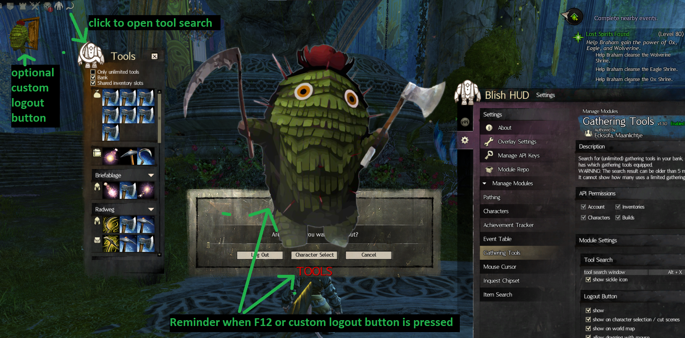

- A Module for the third party overlay https://blishhud.com/ for Guild Wars 2.
- Search for (unlimited) gathering tools in your bank, shared inventory slots, character inventories or which character has which gathering tools equipped.
- WARNING: The search result can be older than 5 minutes because of API delays.
- It cannot show how many uses a limited gathering tool has left because the API does not offer this information.
- Show a reminder when pressing the logout key (default: F12) to not forget putting unlimited tools into shared inventory slots. For this to work make sure the logout key in the module settings matches the logout key in Guild Wars 2.",

